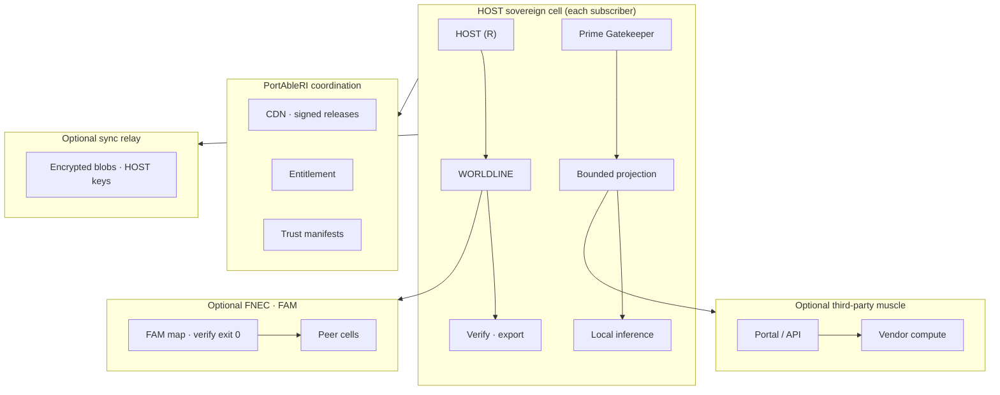

# PortAbleRI · Infrastructure architecture diagram v0

**Date:** 2026-09-24  
**Companion:** `publish/2026-09-24_PortAbleRI_Infrastructure-Doctrine_500M-Scenario_v0.md`  
**Use:** Board · Bobby · counsel · engineering — HOST cell vs relay vs muscle

---

## Diagram · Mermaid source of truth

---

## Legend

| Node | Meaning |
|------|---------|
| **HOST** | Legal and moral authority; not a datacenter |
| **WORLDLINE** | Append-only lineage; exportable |
| **BP** | Only authorized state crosses the boundary |
| **CENTRAL** | No sole memory authority |
| **MUSCLE** | Inference may live here; ledger may not |
| **FNEC / FAM** | No valid map → no peer sync · Improve the map |

---

*End diagram extract.*
