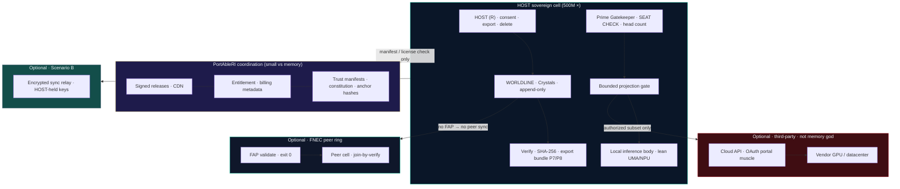

# PortAbleRI · Infrastructure doctrine · 500M subscriber scenario v0

**Product mark:** **PortAbleRI** · `https://www.PortAbleRI.com/`  
**Date:** 2026-09-24  
**Authorship:** John Jeremy · TsiRiaK · KaiRis Systems  
**Epistemic tier:** **B** — architecture scenario (order-of-magnitude; not capacity plan or financial forecast)  
**Tied to:** Build X Phase 0–4 · Constitution SO · FNEC · LRCC frame  
**Operating law:** *They cannot erase what they do not host. Verify locally. Export always.*

---

## Purpose

This document states **what physical and operational infrastructure PortAbleRI needs** if **500,000,000** people subscribed—**provided the kernel stays faithful** to HOST custody, bounded projection (BP), and local verify/export.

It is **not** a promise of scale, funding, or timeline. It is a **doctrine**: what we **build centrally** vs what **must never** become a single memory cathedral.

---

## Core doctrine (one page)

### 1. Memory authority stays on HOST

| Must be true at any scale | Must not be true |
|---------------------------|------------------|
| WORLDLINE + Crystals live on **HOST devices** and exports they control | PortAbleRI operates the **sole** copy of subscriber memory |
| Verify and hash compare run **locally** (Phase 1 **P8**) | Proof requires trusting our dashboard screenshot |
| Corrections **append**; no silent overwrite (Phase 1 **P6**) | “Sync” that rewrites history server-side |

**Implication:** PortAbleRI does **not** need hyperscale GPU continents to **hold** 500M minds. That is the **cathedral** pattern we reject.

### 2. Central infrastructure we **do** operate

| Function | Role | Scales with |
|----------|------|-------------|
| **Signed distribution** | App/installer CDN, updates, revocation keys | Release cadence, download spikes |
| **Entitlement & commerce** | Subscription, fraud, tax, support identity | Subscriber count (metadata, not chat) |
| **Trust manifests** | Constitution version, publish anchor hashes, optional FAP schema | Small, integrity-critical |
| **Operations & law** | Abuse process, lawful requests, uptime of **coordination** APIs | Headcount + process, not EB of chat |

These are **software-company + CDN + payments** scales—not **training/inference warehouse** scales.

### 3. Compute we **do not** centralize (by design)

| Workload | Where it runs |
|----------|----------------|
| **Ledger / lineage** | HOST device · FNEC peers after FAP |
| **Lean inference** | HOST UMA/NPU (Tier A class devices) |
| **Heavy inference (optional)** | **Third-party muscle** or HOST-chosen cloud (**MOLT**) |
| **Agent-turn proof** | Local CPU; public hashes only on web |

**LRCC subtext:** Network freight through **our** servers should stay **small** if BP and local turns are real (see master white paper; replicate before Tier A energy claims at global scale).

### 4. Optional services (product SKUs, not constitutional requirements)

| SKU | Central role | Constraint |
|-----|--------------|------------|
| **Multi-device sync relay** | Encrypted blob store; **HOST holds keys** | Relay is dumb pipe; not WORLDLINE authority |
| **Hosted backup (opt-in)** | Ciphertext only | Export/verify path remains primary |
| **Muscle marketplace** | Broker OAuth/API; **no** merge of session = identity | BP on every outbound projection |

Scenario **B** (hybrid) adds **regional object storage**—still orders of magnitude below monolithic chat clouds.

### 5. Failure mode to avoid (comparison anchor)

If PortAbleRI drifted to **portal SaaS** (500M full-context round trips through our GPUs), infrastructure **reprices** into the same class as cloud-default incumbents—**contradicting** Constitution Art. VIII and the custody patent map (**FIG-PRI-1..3**).

That pattern is the **competitive comparison**, not the product goal.

### 6. Staged path (Build X alignment)

| Build X phase | Infrastructure emphasis |
|---------------|-------------------------|
| **0 · X** | Prime Gatekeeper law; no silent seats |
| **1 · Wave A** | P1 release gate · P7 export bundle · P8 verify |
| **2 · Verify surface** | Anchors on every public release |
| **3 · Access Node hollow** | Public / Private / Commercial **scopes** on BP |
| **4 · Commercial enforce** | Entitlement without seizing WORLDLINE |

**500M is not Phase 0–1 scope.** Doctrine first; measured campaigns later (proof pack D1–D4).

### 7. Equity & honesty at global scale

Not every subscriber owns an 8 GB Air. The kernel **must** tier: lite body, optional cloud muscle, **HOLLOW** labels when metal cannot hold the stack. Global scale increases **support and key-recovery process**—not permission to centralize memory “for convenience.”

### 8. Tier D companion (not marketing headline)

*Provider session is not memory authority; custody portable with the person.*

---

## Architecture diagram · HOST cell · relay · muscle



**Reading the diagram:** Solid custody loop stays inside **HOST**. **CENTRAL** never sits in the WORLDLINE authority path. **RELAY** and **MUSCLE** are optional and BP-gated. **FNEC** connects cells only after **FAP**.

---

## ASCII stack (print-friendly)

```text
┌─────────────────────────────────────────────────────────────┐
│ 500M × HOST CELLS — WORLDLINE · Prime · BP · verify/export │
├─────────────────────────────────────────────────────────────┤
│ Optional: FNEC peers (FAP) · encrypted sync relay · MOLT   │
├─────────────────────────────────────────────────────────────┤
│ PortAbleRI CENTRAL — CDN · entitlement · trust manifests ONLY │
└─────────────────────────────────────────────────────────────┘
         ≠ 500M × full-context GPU warehouse (cathedral)
```

---

## Pointers

| Item | Path |
|------|------|
| Build X Phase 0 | `publish/2026-09-23_Portable-RI_Product-Build-X_Phase0_v0.md` |
| Build X Phase 1 competencies | `publish/2026-09-24_PortAbleRI_Product-Build-X_Phase1-Kernel-Competencies_v0.md` |
| Constitution | `publish/2026-09-23_Portable-RI_Constitution_Individual-Truth-Preservation_v0.md` |
| Patent map | `publish/2026-09-24_PortAbleRI_Patent-Framework_Deep-Dive_v0.md` |
| Scholarly frame | `publish/2026-09-23_KaiRis-Systems_Master-White-Paper_Public-Scholarly-Review_v0.1.md` |

**Version:** `PORTABLERI-INFRA-DOCTRINE-500M-v0` · 2026-09-24

---

*Scenario doctrine only. Measure before marketing global energy or cost savings.*
